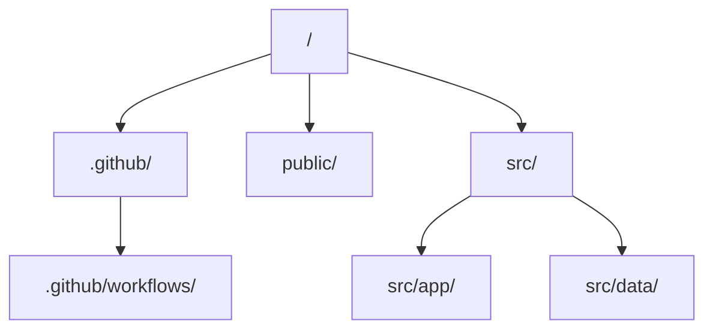

# Active State & Current Architecture

This file documents the active state, current configurations, code graph, and verification status of the current project.

> [!IMPORTANT]
> **Concision Constraint**: Keep all entries in this file extremely concise. Prune deprecated modules or obsolete state immediately to preserve token space.

---

## Active Stack Details

| Layer | Technology | Key Details |
| :--- | :--- | :--- |
| **Framework** | Next.js | Next.js ^15.3.3 |
| **Language/Typing** | TypeScript | TypeScript ~5.8.0 |
| **Testing** | Vitest | Vitest ^4.1.8 |
| **Deployment** | Vertex AI / Cloud Run | Dockerfile + Google Cloud Build |

---

## Architecture / Code Graph

*Describe the high-level architecture or monorepo structure here.*

### Module Descriptions:
- **`.github/`**: Core folder containing project components.
- **`public/`**: Core folder containing project components.
- **`src/`**: Core folder containing project components.

---

## Environment / Security Notes

*List any local environment requirements, mock passcodes, or test API keys needed for development.*

---

## Verification Compliance Status

We enforce strict validation criteria. The current status is:

1.  **Type Checks**: Passing (verified during production build)
2.  **Linting**: Passing (eslint executed with 0 errors)
3.  **Test Suites**: Passing (Vitest suite with 8/8 tests passing)
4.  **Production Builds**: Passing (Next.js build succeeded)
